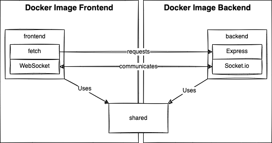

# What is Real Time Pixel Project?

The Real Time Pixel is a game that allows people to add pixel to a canvas to create a collaborative image. Each pixel can be placed after few seconds and pixels have a degradation making them disappear after a few time.

# Project Goals

1. Practice Docker: Dev/Prod
1. Create a distributed system: Web Server, WebSocket Server, Redis Server, etc
1. Create a real-time simple application using Socket.io

# Project Structure

The project is divided in three services: `frontend`, `backend` and `shared`.



## Services

The folder `services` contains all the services that will be deployed. The `shared` folder contains logics, constants and models shared between each side of the application.

## Frontend

The frontend service is built in a Docker container relying on Vite.js while developing and hosted on an NGINX image when in production. The Vite.js is coming with the SolidJS framework allowing quick iteration while developing. The Docker's image is composed of volumes allowing direct access to the developer's computer. The result is a hot-reload of the browser in under two seconds every time a TypeScript file is saved.

The frontend fetches all the pixels for the current board and when the user is clicking to set a new pixel, have a form to create or log in. Once the user is identified, a socket connection opens to communicate between the frontend and backend. The socket allows pushing new pixels but also receiving all pixels from every change performed by every user in real-time on the website.

## Backend

The backend is configured on a separate Docker's file. The Docker relies on an Express webserver hosted in a NodeJS server that refreshes every TypeScript save at development time. In production, the server remains with a NodeJS server without monitoring.

## Shared

The shared folder is not a service by itself. However, the two services rely on the shared folder. To make it works with different Docker image, we are relying on the `paths` configuration of TypeScript. The `paths` create aliases that can be used when importing files using an absolute path. Further detail can be found in this [blog post](https://patrickdesjardins.com/blog/typescript-nodejs-sibling-project) and in this [blog post](https://patrickdesjardins.com/blog/docker-nodejs-shared-folder).

## Environment Variables

All environment variables are defined in the `.env` file at the root of the project. The backend service can access the `.env` using the `dotenv` library. However, the frontend service cannot because the browser executes the JavaScript generated, which does not have a link to the file on the backend. Therefore, there are few solutions like relying on SolidJS's framework for special prefixed variables. However, to avoid having a framework-specific variable name, the solution used is to have a [Python script](https://patrickdesjardins.com/blog/typescript-webproject-environment-variables) to compute a TypeScript constant that has all the keys and values.

## Docker

While developing or publishing, the project must have Docker built and running. Docker will map volumes to the developer machine when in development, allowing quick changes to be picked up by Node (backend and frontend). The two Docker containers run NodeJS and in production, run NodeJS for the backend and NGINX to serve the frontend files. The Docker image builds the code in all environments and runs scripts (e.g., generating environment variables). Hence, the paths in TypeScript's configuration, in package.json, and inside the script are all relative to Docker's file system. Therefore, they are intended to be used inside Docker.

# Security

The system relies on the JWT token. An access token and a refresh token are generated when the user is authenticated. Every operation requires the user to pass the access token. The access token is then verified and, if valid, will unpack the user `id` and `email`. If the access token has expired, the user will be notified. The user will need to send a request with the refresh token to update the access token.

The security pattern is the same for HTTP requests (Rest API) and with WebSocket (Socket.io). In both cases, the routes (or operations) leverage _middlewares_. If one of the middleware finds a problem, it returns a response with a message indicating the authentication reason for the failure to proceed on the desired request.

# How to Get Started

For MacOS, any terminal works. However, for Windows, **Powershell** is required as the WSL has issue with the backend service failing with:

> exited with code 243

1. At the root of this project run:

```
docker-compose build
```

The build will get all the root image (NGINX, Node, etc) and install all the NPM modules.

2. Run the project:

```
docker-compose up
```

Executing the command `up` starts the server depending on the environment variables.

3. Modify the source code. Look at the `.env` file to know which port is open.

# Debug

## How to Debug Docker Build?

If you are using MacOS, change the  `/etc/host` add an entry for `sideproject`. If you are under Windows, change the `C:\Windows\System32\drivers\etc\hosts` file.

```
127.0.0.1 sideproject
```

Having a DNS name instead of direct IP simplify the CORS issue between the frontend and backend (mostly when using sockets).

Run on MacOs:

```
DOCKER_BUILDKIT=0 docker-compose build
```
or

on Windows (PowerShell)

```
$env:DOCKER_BUILDKIT=0
docker-compose build

```

This will give some UUID for each step. Use the UUID for the step to debug with this command:

```
docker run -it <uuid> bash
```

If the build was successful, we can use the image name.

```
docker run -it realtimepixel_backend:latest bash
docker run -it realtimepixel_frontend:latest bash
```

## How to Debug the Backend?

The backend NodeJS server listens to the VsCode default debugging port when running Docker in the development environment. Hence, the step needed is to attach the debugger using the configuration `Docker: Attach to Node` from the `launch.json` file. Then, running the code will hit any of your breakpoints. Breakpoints can be set directly to `.ts` file from the `services/backend/src/**` files. It works because we have the generation of map files in the `tsconfig.json` enabled.

## How to know the name (used in .env for ip)?

Extract the `names` from this command:

```
docker container ls
```

The name should be the in the format : `<directory>_<service name>_1`

## How to get information about the networks?

There are two networks defined in the _docker-compose.yml_ file. It's possible with the following commands to know which containers are part of which networks.

```
docker network ls
docker network inspect realtimepixel_frontend_net
docker network inspect realtimepixel_backend_net
```

See the official [Docker's Networking Tutorial](https://docs.docker.com/network/network-tutorial-standalone/) for more information.

## How to Debug Redis?

You can install and use locally:

```
npm install -g redis-commander
redis-commander -p 9898
```

Then go to http://127.0.0.1:9898

# Production Release

The production build uses the `docker-compose.yml` configuration without the development configuration `docker-compose.override.yml` and with the `docker-compose.production.yml`.

## Step 1: Environment Variables

The `.env` file needs to be changed with production values.

## Step 2: Build and Up

```
docker-compose build
docker-compose -f docker-compose.yml -f docker-compose.production.yml up
```
# Caveat
Currently, there is no email service to validate the account. Hence, using the `redis-commander` is required to change the JSON object of the user and set the `emailValidated` to `true`. However, by default, there is a `test` email (not a valid email) that has the password `123123` to quickly develop the solution.

# Documentations

## Docker References

### Multi-stage and target (FROM/AS)

https://www.docker.com/blog/speed-up-your-development-flow-with-these-dockerfile-best-practices/

### Docker Web App with Multi-Stage

https://nickjanetakis.com/blog/best-practices-around-production-ready-web-apps-with-docker-compose@¤
https://github.com/nickjj/docker-node-example/blob/main/Dockerfile

### Docker with a React Example (REACT CRA start and Nginx)

https://dev.to/karanpratapsingh/dockerize-your-react-app-4j2e
https://medium.com/geekculture/dockerizing-a-react-application-with-multi-stage-docker-build-4a5c6ca68166

### Docker with a Dev and Production setup

https://viralganatra.com/docker-nodejs-production-secure-best-practices/

### How to debug Docker build

https://stackoverflow.com/questions/26220957/how-can-i-inspect-the-file-system-of-a-failed-docker-build

### Docker with Compose file for Development and Production Environments

https://docs.docker.com/compose/extends/#different-environments
https://docs.docker.com/compose/reference/


# Kubernetes

## Fake Production Locally with Minikube
The following steps assume the usage of Windows Powershell. 
Only the first step is required once. All the other steps are required every time you boot your computer or if you start from scratch using `minikube delete --all`.

1. Install [Minikube](https://minikube.sigs.k8s.io/docs/start/)
1. Run Minikube
```
minikube start
```
1. Allowing access of the Docker's images locally to Minikube ([source](https://stackoverflow.com/questions/42564058/how-to-use-local-docker-images-with-minikube)). Must be run every new terminal session.

MacOs:
```
eval $(minikube docker-env)  
```
or

on Windows (PowerShell):
```
minikube docker-env | Invoke-Expression
```

1. Build all the Docker images

The build step relies on the `.env` to extract the `NODE_ENV` to know which target (development or production) to use.
```
docker-compose build
```
From that point, Docker is not used outside the generated images. It means that the DockerFiles and docker-compose.yml are not used anymore.

1. Verify that the Docker images are available
```
docker images "realtimepixel*"
```

1. Push the images to Minikube ([source](https://minikube.sigs.k8s.io/docs/handbook/pushing/#7-loading-directly-to-in-cluster-container-runtime))

```
minikube image load realtimepixel_frontend:latest
minikube image load realtimepixel_backend:latest
minikube image load realtimepixel_redis:latest
```

1. Verify that the Docker images are loaded into Minikube
```
docker image ls
```

1. Get the Kubernetes Configuration to run into Minikube.
```
kubectl apply -f .\kubernetes\production.yaml
```

1. Verify that the pods, services and deployment are running in the project's namespace
```
kubectl get pods -n realtimepixel-prod
kubectl get services -n realtimepixel-prod
kubectl get rs -n realtimepixel-prod
kubectl get deployments -n realtimepixel-prod
```

1. Run the Kubernetes's Dashboard
```
minikube dashboard
```

1. Run a tunnel for the Load-Balancer to get an external up
```
minikube tunnel
```